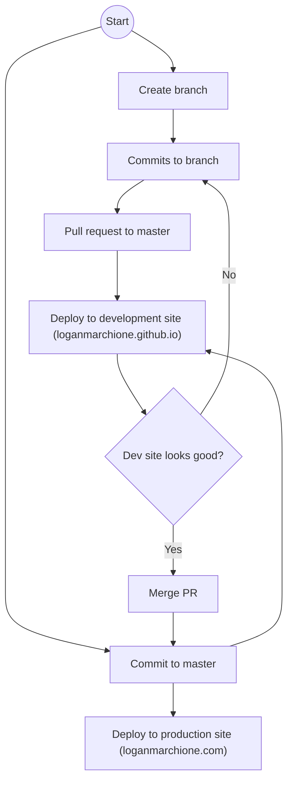

# loganmarchione.com

[](https://github.com/loganmarchione/loganmarchione.com/actions/workflows/production.yml)
[](https://loganmarchione.com)
[](https://loganmarchione.github.io)

## Overview

This repo contains the source for https://loganmarchione.com, built via [Hugo](https://gohugo.io/).

This repo also builds https://loganmarchione.github.io on every PR and update to every PR.

## Usage

```
# get a copy of the code
git clone https://github.com/loganmarchione/loganmarchione.com.git
cd loganmarchione.com

# update hugo modules (optional)
hugo mod get
go mod tidy

# make changes to the site (optional)

# test changes locally
hugo server -DEF --ignoreCache

# test in browser http://localhost:1313

# add, commit, push to kick off GitHub Actions
git add .
git commit -m "Update some stuff"
git push
```

## GitHub Actions

Below is a visual representation of the GitHub Actions workflows.


