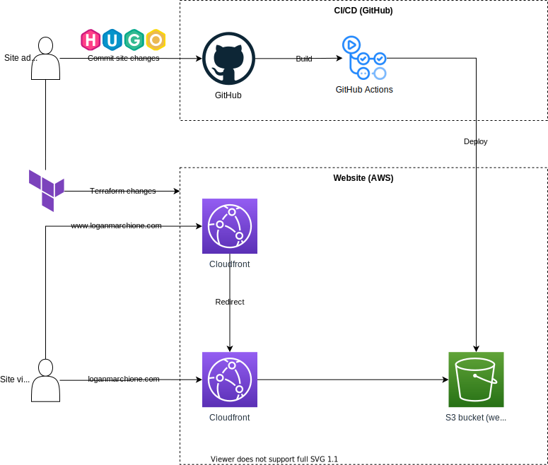

{}

# Introduction

In my [last post](/2021/09/deploying-hugo-with-aws-amplify/), I was testing the deployment of Hugo with [AWS Amplify](https://aws.amazon.com/amplify/). My only complaint was that Amplify doesn't support IPv6. Because of this, I wanted to explore other deployment options under the AWS umbrella.

# CloudFront and S3

As I said in my last post, you can host a [site directly from S3](https://docs.aws.amazon.com/AmazonS3/latest/userguide/WebsiteHosting.html), but it won't have HTTPS. If you put [CloudFront in front of S3](https://aws.amazon.com/premiumsupport/knowledge-center/cloudfront-serve-static-website/), you get all the benefits of HTTPS and Amazon's CDN.

## Setup

I won't cover the technical details of the setup here, you can Google for that.

For the admin user (i.e., me), I used Terraform to create the AWS infrastructure (DNS, certificates, S3 bucket, CloudFront distribution, etc...) and GitHub/GitHub Actions to host, build, and deploy the code to S3.

For visitors, CloudFront handled HTTPS and redirects from the `www` site. The HTML files hosted in S3 were not directly accessible (i.e., I used a CloudFront [origin access identity](https://docs.aws.amazon.com/AmazonCloudFront/latest/DeveloperGuide/private-content-restricting-access-to-s3.html) to restrict access).

Below was the minimum viable product I setup for my testing. There were other things missing from here that would be in a production setup, like buckets for logging, Lambda functions, etc...

In practice, this setup was difficult to get going. In Terraform, I had to create the following items:
* DNS entries (using Route53)
* S3 bucket (for static files generated by Hugo)
* S3 bucket policy (to allow CloudFront access)
* Certificates (and automatic validation)
* CloudFront distribution
* IAM user (for GitHub Actions)
* IAM user policy (to allow access only to S3)

Then, I had to setup GitHub Actions and my Hugo deployment settings, which took a few tries to get right.

## What I liked

* Fine-grained control - CloudFront has some pretty powerful options, like [geo restrictions](https://docs.aws.amazon.com/AmazonCloudFront/latest/DeveloperGuide/georestrictions.html), [web application firewalls](https://docs.aws.amazon.com/AmazonCloudFront/latest/DeveloperGuide/distribution-web-awswaf.html), [price classes](https://docs.aws.amazon.com/AmazonCloudFront/latest/DeveloperGuide/PriceClass.html), and more. I was very impressed with the amount of control it offered.
* IPv6 - As I said in my last post, I wanted IPv6 support, and CloudFront checked that box for me.
* S3 - S3 is addictive and way too convenient. It's like having an unlimited hard drive in the cloud. I'll probably keep using it to store other assets for my site, even if the site isn't hosted on S3 itself.

## What I didn't like

* Complicated setup - The Terraform code required for setup was complicated. Especially frustrating was the [nugget of information](https://docs.aws.amazon.com/AmazonCloudFront/latest/DeveloperGuide/cnames-and-https-requirements.html#https-requirements-aws-region) I missed about CloudFront certificates only working if they were created in the `us-east-1` region (I was using a different region).
* URL redirects - I have a few custom URL redirects setup, and CloudFront doesn't support those natively without an [edge function](https://docs.aws.amazon.com/AmazonCloudFront/latest/DeveloperGuide/edge-functions.html) (while Amplify [does](https://docs.aws.amazon.com/amplify/latest/userguide/redirects.html)). Right now, if I'm going to switch, it needs to be easier than Nginx.

# Conclusion

Ultimately, I choose the tear down my CloudFront and S3 demo site in favor of my plain-old Nginx server. If you're keeping track, the score is:

| Product     | Score |
| ----------- | ----- |
| Nginx       | 2     |
| Serverless  | 0     |

If you host a Hugo site, tell me how! I'm open to any options!

\-Logan