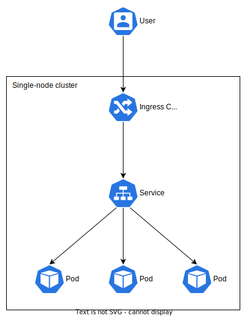

# Introduction

I'm starting a new job in the next few days that will require me to learn Kubernetes (often stylized as k8s). This post is not about what k8s is or why you want it (you can read about that [here](https://kubernetes.io/docs/concepts/overview/what-is-kubernetes/)). My only objective for now is to have a single-node k8s cluster running in my homelab.

⚠️ WARNING ⚠️

- I am not a Kubernetes expert!
- This is solely for my own learning. If you get something useful out of my ramblings, that's great, but it's not my primary goal.
- Nothing I setup here should be considered production-ready or secure.

## Lightweight k8s

Production k8s installations can vary in size and complexity, but upstream k8s has a ton of components and moving pieces (etcd, kube-apiserver, kube-scheduler, kubelet, DNS, etc...). As you can imagine, it's complicated to setup correctly, especially on resource-limited or single-node clusters. Out of necessity, there are now quite a few lightweight k8s distributions that not only strip out the features most people won't use, but also simplify installation and setup.

- [k0s](https://k0sproject.io/) (made by Mirantis, who owns Docker, Inc.)
- [MicroK8s](https://microk8s.io/) (made by Canonical, who also makes Ubuntu)
- [K3s](https://k3s.io/) (made by [Rancher](https://rancher.com/), which was recently [purchased](https://www.suse.com/news/suse-completes-rancher-acquisition/) by SUSE)
- [minikube](https://minikube.sigs.k8s.io/) (the "official" mini-k8s distribution)

I'm going with K3s because it seems to have the largest community, it's [CNCF-certified](https://www.cncf.io/projects/k3s/), and it's lightweight (~60MB binary).

## Single-node? Why?

Obviously, a single-node cluster provides no H/A or failover capability. However, you interact with a single-node cluster the same way you do a 100-node cluster. This is all about learning, not about being highly-available, efficient, or practical.

# Install K3s (on the server)

These commands should be entered on the server that will run K3s. In my case, this is a virtual machine running Debian 11.

Run the command below to install K3s on your server. Pro-tip: If you're doing this in a VM, take a snapshot now so you can roll back later if you mess up!

```
curl -sfL https://get.k3s.io | sh -
```

Once it's done, check that K3s is running.

```
sudo systemctl status k3s.service
```

Verify your cluster and node info.

```
sudo kubectl cluster-info
sudo kubectl get node
```

Congrats! Your single-node cluster is running! Now, view the contents of the `/etc/rancher/k3s/k3s.yaml` file, we'll need this later.

```
sudo cat /etc/rancher/k3s/k3s.yaml
```

Also, if there is a firewall on your server, you'll need to open `6443/tcp` for external cluster access (I'm using UFW).

```
sudo ufw allow 6443/tcp
sudo ufw reload
```

# Setup kubectl (on your personal machine)

These commands should be entered on the machine that will interact with your K3s cluster. In my case, this is a desktop running Arch Linux.

The tool used to interact with a k8s (or K3s) cluster is called [kubectl](https://kubernetes.io/docs/tasks/tools/), which is included with K3s. However, you typically don't SSH to the server to interact with the cluster. Instead, you install kubectl on your personal machine (desktop, laptop, etc...) and connect to the cluster remotely.

I'm running Arch, so I installed [kubectl](https://archlinux.org/packages/community/x86_64/kubectl/) with pacman.

```
sudo pacman -S kubectl
```

Run the command below to make sure kubectl works. For now, ignore the error about the connection to the server not working.

```
kubectl version --output=yaml
```

Next, create an empty directory to hold the configuration file for kubectl.

```
mkdir -p ~/.kube
touch ~/.kube/config
chown $(id -u):$(id -g) ~/.kube/config
chmod 600 ~/.kube/config
```

Now, copy/paste the contents of `/etc/rancher/k3s/k3s.yaml` from the server into `~/.kube/config` on your personal machine. While you're doing this, replace the IP (which is probably `127.0.0.1`) with your server's IP (mine was `10.10.1.51`).

Run the commands below and you should be able to see cluster info from your personal machine.

```
kubectl version --output=yaml
kubectl cluster-info
kubectl get node
```

Congrats! You can now interact with your cluster remotely!

# Deploy example application

We're going to deploy three instances of an example application called [traefik/whoami](https://hub.docker.com/r/traefik/whoami). This is a webserver written in Go that prints operating system information and HTTP request to output. This is a _very_ simplified setup of how traffic will flow from your client to the containers in the pods.



Kubernetes resources (pods, deployments, services, etc...) are written in plaintext JSON or YAML files called [manifests](https://kubernetes.io/docs/reference/glossary/?all=true#term-manifest). Think of manifests like `docker-compose` files. I recommend storing all of your manifests in a directory for easy management and version control (again, like `docker-compose` files).

```
mkdir -p ~/k8s/whoami
```

We're going to create the following resources in one manifest file:

1. Namespace - This is a best-practice way to segment the cluster (both in software and in administration)
1. Deployment - This is where we define our container image and how many replicas we want. This is what creates the pods, which will have our containers in them.
1. Service - This exposes our pods to eachother, as well as to the cluster itself. Remember, the pods can come and go, so their IP addresses might change over time. A service is a reliable address.
1. Ingress - This exposes the services inside the cluster to the outside world. An ingress is a set of rules for traffic, while the ingress controller is the thing doing the work (e.g., nginx, Traefik, etc..).

You can copy/paste the command below to create the manifest.

```
cat << EOF > ~/k8s/whoami/whoami.yml
---
apiVersion: v1
kind: Namespace
metadata:
  name: k3s-test
---
apiVersion: apps/v1
kind: Deployment
metadata:
  name: whoami-deploy
  namespace: k3s-test
  labels:
    app: whoami
spec:
  replicas: 3
  selector:
    matchLabels:
      app: whoami
  template:
    metadata:
      labels:
        app: whoami
    spec:
      containers:
        - name: whoami
          image: traefik/whoami:v1.8.0
          ports:
            - name: whoami
              containerPort: 80
---
apiVersion: v1
kind: Service
metadata:
  name: whoami-svc
  namespace: k3s-test
  labels:
    service: whoami
spec:
  type: ClusterIP
  ports:
    - name: http
      port: 80
      protocol: TCP
  selector:
    app: whoami
---
apiVersion: networking.k8s.io/v1
kind: Ingress
metadata:
  name: whoami-ingress
  namespace: k3s-test
  annotations:
    traefik.ingress.kubernetes.io/router.entrypoints: web
spec:
  rules:
    - http:
        paths:
          - path: /test
            pathType: Prefix
            backend:
              service:
                name: whoami-svc
                port:
                  number: 80
EOF
```

Next, deploy the manifest (again, kubectl on our personal machine connects to the cluster).

```
kubectl apply -f ~/k8s/whoami/whoami.yml
```

Using the commands below, you can see the namespace, pods, deployment, service, and ingress (as well as their respective IP addresses).

```
kubectl get namespaces
kubectl get pods --namespace k3s-test -o wide
kubectl get deployments --namespace k3s-test -o wide
kubectl get services --namespace k3s-test -o wide
kubectl get ingress --namespace k3s-test -o wide
```

In a browser, visit `http://your_node_ip/test` (replace `your_node_ip` with your single-node cluster's IP, which should be the same IP from the `kubectl get ingress` command). Refresh this page, and you should see the IP changing (a total of three different addresses, since we specified three replicas and Traefik is load balancing between them).

When finished, delete the deployment.

```
kubectl delete -f ~/k8s/whoami/whoami.yml
```

# Conclusion

Like I mentioned, this cluster is for learning. I have my homelab (more about that setup [here](/2021/01/homelab-10-mini-rack/)) running mostly on docker-compose. My plan is to make this a multi-part series (learning K3s as I go), then slowly start migrating applications to K3s. Before I do that, I'll need to investigate the following things:

- Persistent storage (i.e., volumes)
- Secret storage (e.g., passwords, database connection strings, etc...)
- Ingress (accessing applications from outside the cluster)
- SSL/TLS
- Backups

If you're running K3s (or any k8s distribution) at home, I'd love to hear about it!

\-Logan