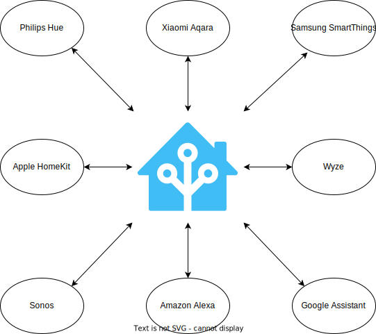

# TL;DR

In my opinion, these self-hosted, open-source applications are the best of what open-source can be.

* [Home Assistant](https://www.home-assistant.io/)
* [Jellyfin](https://jellyfin.org/)
* [Pi-hole](https://pi-hole.net/)
* [Nextcloud](https://nextcloud.com/)
* [WordPress](https://wordpress.org/)

# Introduction

My hot water tank recently leaked, but (luckily for me) there was a floor drain right next to it. The next day (after having the tank fixed), I purchased a water leak sensor, added it to Home Assistant in under 2 minutes, and was able to get push notifications of future detected leaks.

This got me thinking about other self-hosted, open-source applications that are truly amazing works of engineering and community collaboration. Below is what I came up with.

| Project                                                                                                          | Category               | Paid tier?                                                | Language                                               |
| ---------------------------------------------------------------------------------------------------------------- | ---------------------- | --------------------------------------------------------- | ------------------------------------------------------ |
|  [Home Assistant](https://www.home-assistant.io/)  | Home automation        | [Nabu Casa](https://www.nabucasa.com/)                    | [Python](https://github.com/home-assistant/core)       |
|  [Jellyfin](https://jellyfin.org/)                      | Media server           | N/A                                                       | [C#](https://github.com/jellyfin/jellyfin)             |
|  [Pi-hole](https://pi-hole.net/)                          | Network-level ad-block | N/A                                                       | [Shell/Python/PHP](https://github.com/pi-hole/pi-hole) |
|  [Nextcloud](https://nextcloud.com/)                   | Personal cloud         | [NextCloud Enterprise](https://nextcloud.com/enterprise/) | [PHP/JS](https://github.com/nextcloud/server)          |
|  [WordPress](https://wordpress.org/)                   | Blogging               | [WordPress.com](https://wordpress.com/)                   | [PHP/JS](https://build.trac.wordpress.org/browser)     |

I'm aware that this is not an exhaustive list, and that most of these applications stand on the shoulders of giants. However, when trying to sell "regular people" on self-hosted, open-source applications, this is the list to start with.



# Home Assistant

I'm certainly not a Home Assistant power user, but I will say this is one of the most useful applications that I self-host. Even if I'm not logging into the application itself on a consistent basis, Home Assistant is always there, running in the background, automating my life.

If you're not aware, [Home Assistant](https://www.home-assistant.io/), is a home automation tool (e.g., turn on the lights when I get home, if the living room is above 75 F turn on the A/C, etc...). What makes Home Assistant so special is that it allows you to break out of the walled gardens of vendors (Philips, Aqara, SmartThings, Wyze, etc...). Home Assistant acts as a "hub", allowing you to collect data (and act on it) from multiple different sources.

 Want your Samsung WiFi-connected smart A/C unit to turn on when your Aqara Zibgee-connected temperature sensor reads 75 F? Want your Wyze camera to detect motion and send you snapshot via Telegram message? Want your Philips lights and SmartThings switches to display natively in your iPhone's Home app? Home Assistant can do all of that, [and more](https://www.home-assistant.io/docs/automation/basics/)!

 Home Assistant has a paid tier called [Nabu Casa](https://www.nabucasa.com/) that offers (among other things) secure, remote access to your locally-hosted Home Assistant instance.

# Jellyfin

For those not in the know, Plex/Jellyfin/Emby, are in the "be your own Netflix" category.

I will start off by saying that I'm a lifetime [Plex Pass](https://www.plex.tv/plex-pass/) holder, but I haven't used it in years. I had grown increasingly frustrated with Plex's internet-connected login requirements, their branching into other services (live TV, DVR, etc...), and their phone-home requirments, all when I just wanted to play media locally.

To that end, I almost cannot believe that something as simple, convenient, and powerful as [Jellyfin](https://jellyfin.org/) is a free product. It is a local-first and private-first media server, allowing you to consume your media (movies, TV, music, books, comics, and audiobooks) on almost any device. It offers a ton of [clients](https://jellyfin.org/clients/) for all major platforms, including web, iOS, Android, Roku, Android TV, and more. Jellyfin also has hardware-accelerated transcoding, metadata downloading, 4K support, sync-play, plugins, and has a huge [community of contributors](https://github.com/jellyfin/jellyfin/graphs/contributors).

In the past year, Jellyfin has really come a long way and is a viable alternative to Plex. Its clients might not be as polished as Plex's, and it may lack some next-level features (skip intros, no-setup remote access), but Jellyfin does 99.9% of what Plex does, while being 100% open-source and local-first.

# Pi-hole

I don't run [Pi-hole](https://pi-hole.net/) personally, but it's mentioned everywhere online. It is a DNS-based sinkhole used to block ads on your *entire network*. This means that instead of setting up ad-block on every browser, you can setup Pi-hole on your network, and it will block ads on every device on your network (including mobile apps and smart TVs). Because the traffic is blocked on a network level, network performance will be improved and your browsing experience will feel faster (because it is). Blocking ads isn't just about convenience, it's also about security, since Pi-hole's blocklists block potential spam and malware, as well as known bad-actors.

Pi-hole (as the name implies) originally started as a Raspberry Pi project, but now runs on x86 hardware, as well as Docker. It also offers a DHCP server, and a web-based dashboard for configuration and viewing statistics (screenshot below).



# Nextcloud

I don't run [Nextcloud](https://nextcloud.com/) personally, but it's a stand-out in its field. Competing with giants like Google and Microsoft, Nextcloud is a "personal cloud", offering self-hosted versions of mail, contact, calendar, kanban, video/audio calls, web hosting, file storage/sync, document editing, an [app store](https://apps.nextcloud.com/), and more. If there is one application you could use to build your digital life around, it would be Nextcloud.

Nextcloud also has a ton of business-centered administration features, such as logging/monitoring, 2FA, file access control, LDAP integration, compliance (e.g., HIPAA, GDPR, etc...), encryption in-transit and at-rest, and more.

NextCloud offers a paid tier called [NextCloud Enterprise](https://nextcloud.com/enterprise/), but the code base for both the home and enterprise versions are the same. The enterprise subscription gets you access to their support and technical teams, as well as some optional features and plugins.

# WordPress

I couldn't make this list without mentioning [WordPress](https://wordpress.org/). WordPress is the platform that powers [43% of all websites](https://kinsta.com/wordpress-market-share/) *in the world*. It's [used by some huge websites](https://wordpress.org/showcase/), including [Rolling Stone](https://wordpress.org/showcase/rolling-stone/), [Time magazine](https://wordpress.org/showcase/time-com/), [Snoop Dogg](https://wordpress.org/showcase/snoop-dogg/), [TechCrunch](https://wordpress.org/showcase/techcrunch/), and the *freaking* [White House](https://wordpress.org/showcase/the-white-house/).

WordPress has a seemingly infinite number of features, including a "store" with free/paid themes and plugins, [WYSIWYG](https://en.wikipedia.org/wiki/WYSIWYG) editor, post scheduling and versioning, user management tools, media management tools, comments, SEO, and more. Oh, and did I mention they allow you to import/export your data to/from almost any other blogging platform? No lock-in here.

WordPress is technically a content-management system (CMS), so it needs a filesystem, MySQL database, and webserver in order to work. However, if that sounds confusing or intimidating to you, WordPress offers a paid tier at [WordPress.com](https://wordpress.com/) to handle everything for you, and let you get down to creating.

WordPress gets a bad rap because of PHP, but it is *the gateway drug* to blogging. I started this blog almost 10 years ago, using WordPress. I've since transitioned away from it (because I'm a nerd and like to make things complicated), but I wouldn't be here without it.

# Conclusion

All of these applications have a few things in common. They are all:

* open-source
* privacy-first
* community-driven

They are true technical (as well as collaborative) marvels, and are the first step into self-hosting and the open-source world. I could add 50 other applications to this list (WireGuard, Gitea, Traefik, OPNsense, Proxmox, etc...), but these five are, in my opinion, success stories that are unrivaled.

\-Logan