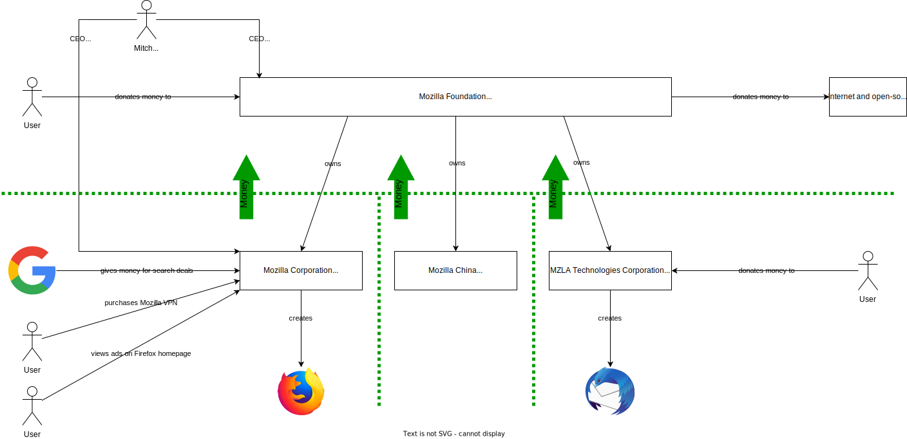
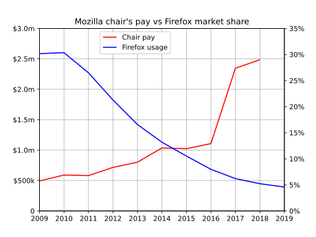

# TL;DR

I'm frustrated by Mozilla, but don't see many alternative browsers that have such noble goals as Firefox.

# Introduction

I have a confession: I tried *really hard* to quit [Firefox](https://www.mozilla.org/en-US/firefox/browsers/), but I can't.

I've been using Firefox since the single-digit release days, and I've been [publishing my Firefox config](https://github.com/loganmarchione/Firefox-tweaks/tree/d9ed559dd1bac6c7b0130b851b2026ae77e05383) for five years now. In a recent experiment, I used [Brave Browser](https://brave.com/) exclusively for three months, but ended up moving back to Firefox. Here are my thoughts (i.e., a rant) on why I moved, why I moved back, and why I might not be done moving.

# Firefox's rise...

Firefox gained popularity at a time when smartphones were not a thing, Windows XP was still supported, and Internet Explorer (IE) dominated the browser market. Because IE came pre-installed on Windows, it was the browser of choice for most people. Firefox was the *only* alternative (unless you used a Mac, in which case, you used Safari). At it's peak, Firefox was estimated to have around 30% of the [global desktop browser market share](https://gs.statcounter.com/browser-market-share/desktop/worldwide#monthly-200901-202207) (see image below) and [over 50% in some markets](https://blog.mozilla.org/metrics/2008/12/01/firefox-surpassing-50-market-share-in-more-regions/).



# Firefox's fall...

For current reference, here are the stats from July 2022. What happened?



## Chrome's dominance

In September 2008, Google [announced](https://googleblog.blogspot.com/2008/09/fresh-take-on-browser.html) Google Chrome, which exploded in popularity because:

* Web browsers were *slow* and Chrome was *fast*. Google was able to build Chrome completely from scratch (i.e., it had no technical debt like Microsoft's IE), but could borrow tech where needed (e.g., Apple's [WebKit](https://en.wikipedia.org/wiki/WebKit) engine), and then create tech where needed (e.g., the super-fast [V8 Javascript engine](https://en.wikipedia.org/wiki/V8_(JavaScript_engine))).
* Chrome adhered to web standards (something IE was not known for).
* Tab sandboxing improved security, but also meant one tab crashing wouldn't kill the entire browser. This also allowed each tab to run in a separate process, which made better use of multi-core CPUs.
* Google open-sourced [Chromium](https://www.chromium.org/Home/) (Google Chrome's base).

## The tragedy of the default

Unlike its competitors, [Mozilla](https://www.mozilla.org/) (the company that makes Firefox) has no platform on which to advertise Firefox:

* Microsoft pre-installs Edge and can advertise Edge on Microsoft services (e.g., Bing, Office 365, etc...)
* Apple pre-installs Safari on all of their devices
* Google pre-installs Chrome on Android and can advertise Chrome on Google services (e.g., Search, Gmail, etc...)

Most users can't or won't switch away from anything provided by default.

## Mozilla Foundation vs Corporation

Before we go on, it's important to understand how Mozilla is structured and how they make money. I've tried to visualize this in an image below (probably best to open it in a [new tab](/2022/08/i-tried-to-quit-firefox-i-cant/20220802_002.svg)), but will spell out some key details here.

"Mozilla" is an ambiguous term. The Mozilla Foundation, which is a 501(c)(3) non-profit, owns three for-profit companies:

* Mozilla Corporation (they make Firefox)
* Mozilla China (they promote Mozilla in China)
* MZLA Technologies Corporation (as-of early 2020, they make Thunderbird)

Mitchell Baker, who started at Netscape, is currently the CEO of both Mozilla Foundation (where she makes $0/yr) and Mozilla Corporation (where she makes $2.75m/yr).

The Mozilla Foundation only makes money by donations from users (e.g., when you go to [this page](https://donate.mozilla.org/)) and corporations. The Mozilla Foundation uses the money to [fund](https://foundation.mozilla.org/en/what-we-fund/) various internet and open source projects. **Donations to the Mozilla Foundation do not fund Firefox development because money cannot be given from the Foundation to the Corporations.**

The Mozilla Corporation does not accept donations from users. Of their $496m in revenue in 2020, 89% came from search deals, with only 5% coming from subscription services (e.g., Mozilla VPN or Pocket) and advertising (on the Firefox homepage). 

MZLA Technologies Corporation takes donations directly from users to [fund Thunderbird development](https://blog.thunderbird.net/2022/05/thunderbird-2021-financial-report/).

See these documents ([one](https://assets.mozilla.net/annualreport/2020/mozilla-fdn-2020-short-form-0926.pdf), [two](https://assets.mozilla.net/annualreport/2020/mozilla-2020-form-990.pdf), [three](https://projects.propublica.org/nonprofits/organizations/200097189)) for more financial details.

## Mozilla's internal problems

Mozilla has mismanaged their money and Firefox's development for the better part of a decade. They are clearly struggling to figure out how to make non-Google money, what to do with their current money, and where Firefox fits in.

* Since 2008, Firefox's market share has fallen 85%, but CEO Mitchell Baker's pay rose over 400% in the same time period (when asked directly, she said it would be a [financial burden to lower it](https://twitter.com/lizardlucas42/status/1293232090985705478)). I *highly* recommend reading [Cal Paterson's excellent post](https://calpaterson.com/mozilla.html) about the topic (image below from Cal's site).

* In 2017, [Mozilla Corporation spent an unknown amount of money on Pocket](https://blog.mozilla.org/en/mozilla/news/mozilla-acquires-pocket/), the read-it-later app.
* In 2020, in an effort to diversify revenue sources, Mozilla Corporation launched Mozilla VPN, which is a rebranded service of Mullvad VPN.
* In the meantime, Mozilla Corporation [laid off 70 employees in January 2020](https://arstechnica.com/gadgets/2020/01/mozilla-lays-off-70-people-as-non-search-revenue-fails-to-materialize/), then [another 250 in August 2020](https://arstechnica.com/information-technology/2020/08/firefox-maker-mozilla-lays-off-250-workers-says-covid-19-lowered-revenue/). 
* In terms of products, Mozilla appears to have no direction and seems to be throwing shit at a wall and seeing what sticks (hint: none of it sticks). The following projects have been cancelled: Firefox OS, Firefox Send, Firefox Lockwise, Firefox Reality, Mozilla Persona, Mozilla WebThings, Mozilla Webmaker, and more.
* Mozilla (a small company in a post-COVID world) [pays for office space](https://www.mozilla.org/en-US/contact/spaces/) in some of the most expensive cities in the world (San Francisco, Berlin, Beijing, Toronto, etc...).

# Why I tried to quit Firefox (and why I went back)

I recently met someone who works for Brave, and after some talking, they convinced me to give Brave a try. It had everything I needed (e.g., all of Chromium, mobile apps, plus things like built-in ad-blocking and sync support, etc...). While generally not a huge fan of cryptocurrencies, I agree with Brave that web advertising is fundamentally broken. I think [Basic Attention Token](https://basicattentiontoken.org/) (BAT), while not perfect, is a step in the right direction (if nothing else, it's different than what we have now).

I imported my bookmarks into Brave and setup sync between my devices (I really liked the no-account sync setup). Brave was available for all of my devices, loaded pages quickly, no sites were broken, and sync always worked. Hell, I even  became a verified [Brave Creator](https://creators.brave.com/). After a few months of use, I had no complaints.

However, as an open source advocate, I honestly felt *guilty* using Brave.

## Browsers and browser engines

While there might be [many browsers](https://en.wikipedia.org/wiki/List_of_web_browsers), both large and small, there are only a handful actively maintained of [browser engines](https://en.wikipedia.org/wiki/Comparison_of_browser_engines) (the things that render the HTML/CSS into what you see on the page):

* WebKit - used by Apple for Safari
* Gecko - used by Mozilla for Firefox and Thunderbird
* Blink - used by Google Chrome, Chromium, and all Chromium-based browsers (e.g., Edge, Brave, Vivaldi, Samsung, Opera, etc...)

By having a huge market share, Google (who controls Blink) could create a Blink-based browser monoculture. In fact, right now, many developers don't even test their websites and applications in anything other than Chrome. By using Firefox, I'm hoping that I'm helping to diversify browser engines and show that choice (and adherence to standards) is important.

## Browsers based on other browsers

As I mentioned, many browsers are [based on Chromium](https://en.wikipedia.org/wiki/Chromium_(web_browser)#Browsers_based_on_Chromium). This begs the question: Why aren't there many popular Firefox-based alternatives? I can see two reasons for this:

* Blink was designed to be modular and embeddable, whereas Gecko is practically bound to Firefox.
* Blink is very permissively licensed, whereas Gecko uses the less-permissive [Mozilla Public License](https://en.wikipedia.org/wiki/Mozilla_Public_License).

When [Brendan Eich](https://en.wikipedia.org/wiki/Brendan_Eich) (the creator of Javascript and ex-Mozilla CEO), created Brave, he [originally based it on Gecko](https://brave.com/the-road-to-brave-one-dot-zero/). However, this proved to be too much work and Brave was later switched to Chromium. Even Microsoft abandoned EdgeHTML (their original browser engine for Edge) and switched to Chromium.

Making a browser is hard work, costs a lot of money, has high stakes, and most projects want the least resistance. If Chromium/Blink offer a better experience than Firefox/Gecko, you can't blame projects for not basing their products on Firefox/Gecko.

# Conclusion

I’m frustrated by Mozilla. I want Firefox to succeed, and I believe in Firefox's goal of creating an open and accessible internet, but I don't know how to help Firefox.

Obviously, Mozilla Corporation exists to make money, but their dependence on Google for search royalties isn't sustainable long-term. At this point, Firefox only exists because Google *allows* it to exist. As Firefox's market share shrinks, Google will pay Mozilla Corporation less and less, which will cause Mozilla Corporation to layoff more employees, which will cause work on Firefox to stall, which will cause it's market share to shrink, etc...

I've debated paying for a Mozilla VPN subscription that I won't use, but there is no guarantee that money will go towards Firefox. I'd prefer to be able to donate to Firefox directly, like I can with Thunderbird. For now, I'm spreading the Firefox gospel where possible. Although this post was a rant about Mozilla, I'm hard on them because I love Firefox and I know they can be better stewards of the only remaining independent browser.

\-Logan